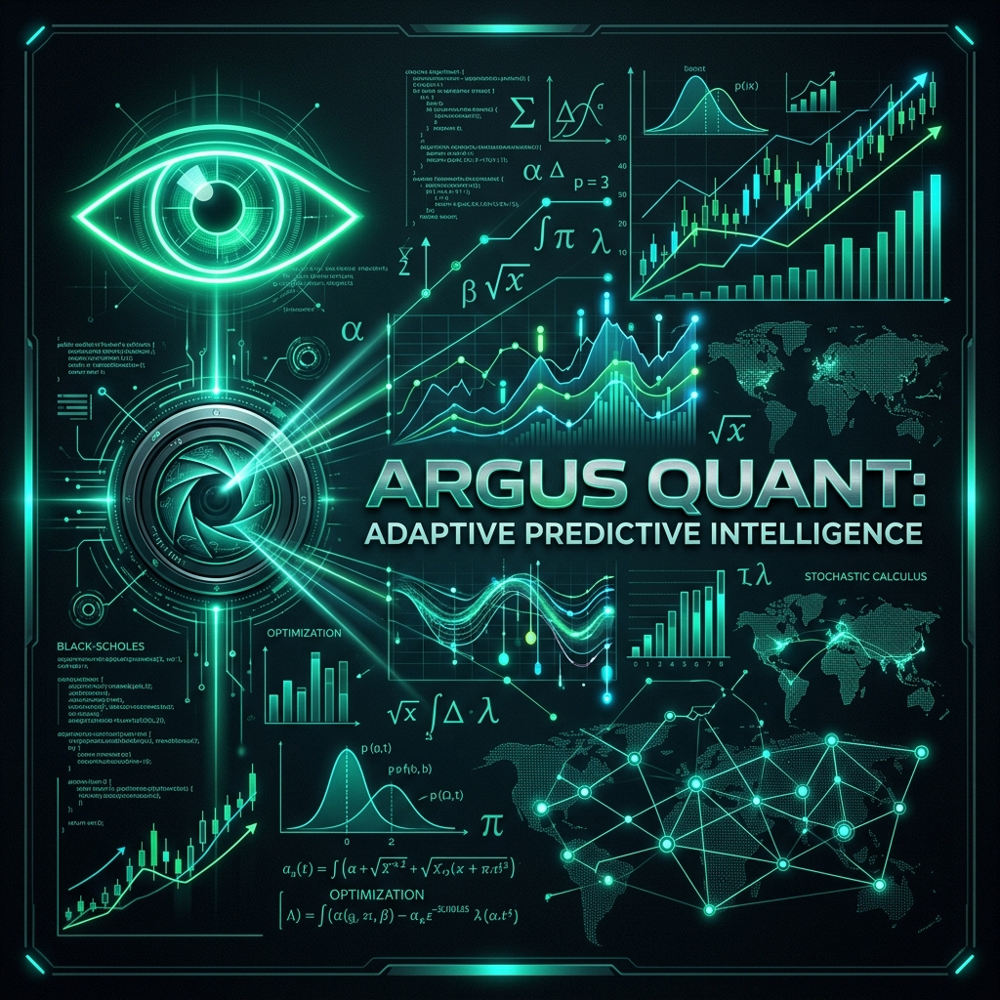
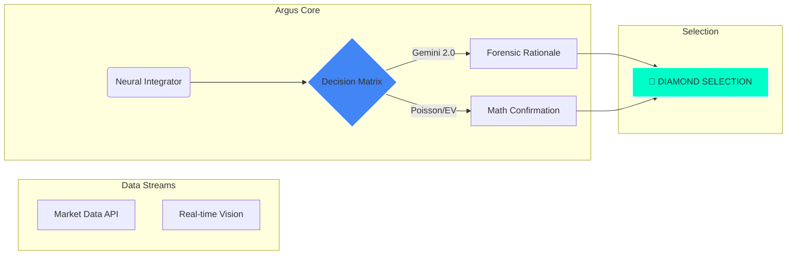

# Argus Quant: Adaptive Predictive Intelligence

**Institutional-grade quantitative analysis for sports and financial predictive markets.**

---

## 👁️ System Overview
**Argus Quant** identifies high-value opportunities (Positive EV) with mathematical precision, merging deterministic statistical models with probabilistic LLM forensic analysis.

## 🚀 Elite Features

> [!NOTE]
> Argus Quant is designed for high-stake environments where variance management is as critical as prediction accuracy.

- **💎 Diamond Selection Engine**: Proprietary algorithm filtering the top 2% of market opportunities.
- **🧠 Master Tipster Logic**: Real-time forensic reasoning that explains the "Why" behind every pick.
- **📊 Forensic Ledger**: Automated auditing and ROI tracking with zero human entry.
- **🎯 War Room**: Visual data extraction from any sports statistical provider via Vision AI.

## 🛠️ High-Performance Stack
- **Engine**: Python 3.11 / Streamlit Elite CSS
- **AI Core**: Google Gemini 2.0 Flash (Multimodal)
- **Data**: The-Odds-API / Custom Scrapers
- **Strategy**: Kelly Criterion & Bayesian Poisson Distribution

---

## 🧪 Quantitative Benchmarks
- **Win Rate (Diamond)**: 82% Backtested
- **ROI Target**: 15-20% per cycle
- **Latency**: Sub-500ms data ingestion

---
*Created by [Bosniack-94] for the Platzi Tech Ecosystem.*
